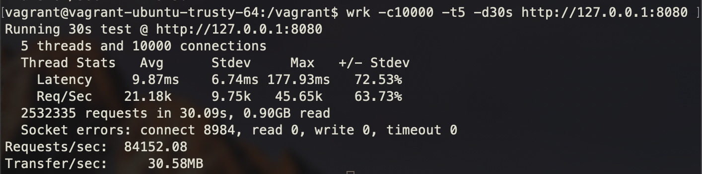
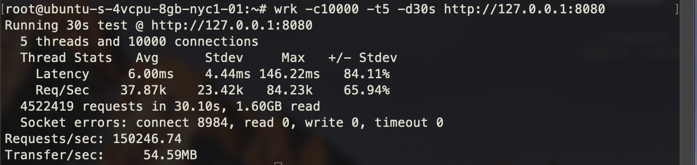
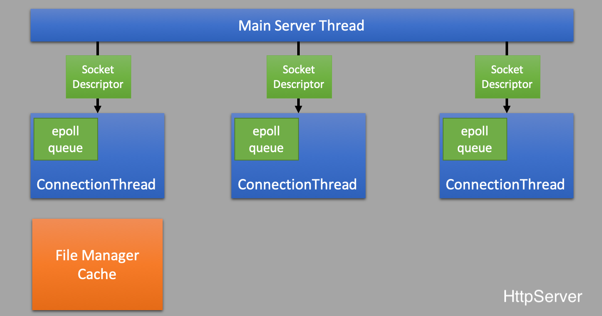

# fasthttp
fasthttp is a __multithreaded__, __async I/O__ HTTP server written in C++ for Linux. 

#### Features
* Multithreaded, asynchronous request handling.
* HTTP persistent connection and pipelining (for HTTP/1.1).
* Specify server configuration in a .yml file [TODO]
* Supports HTTP HEAD, GET methodes.
* Supports Chunked-Transfer [TODO]
* Supports Conditional GETs [TODO]
* C++ Functors callback programming pattern.
* In-memory file manager with cache to speed up reads of the same file.

### Getting Started
The repository contains a `Vagrantfile` that provisions an `Ubuntu 14.04` VM to help with setting up of the dev environment. In order to utilise the `Vagrantfile`, make sure Vagrant is installed on the local machine. Vagrant also requires a VM provider - a common option is VirtualBox- to be installed. 

```sh
git clone https://github.com/awhdesmond/fasthttp.git
cd fasthttp
make
./main 8080
```

The `main.cpp` file contains an example program that make use of the __fasthttp__ HTTP server.

> On the Vagrant VM, there may be a need to increase the number of file descriptors available if more threads are specified to be ran. The value I used was 1200000 to support 3 threads.
> 1. Edit the following line in the `/etc/sysctl.conf` file:
> `fs.file-max = value`
> 2. Apply the change by running the following command:
> `/sbin/sysctl -p`.

### Benchmarking
On the Vagrant VM 4GB/4CPU (MacOS host (8GB/1CPU(2 Cores))): 
  

On DigitalOcean's Standard 8GB/4CPU(4 Cores) droplet running Ubuntu 16.04:
This is similar configuration to a normal modern personal laptop.



### Architecture

__fasthttp__ uses UNIX/Linux networking system APIs to enable its __multithreading__ and __async I/O__ functionalities. 



__HttpServer__

__HttpServer__ is the class that encapsulates all the inner-workings of __fasthttp__ and provides a clean API for creating server applications. Here are its functionalities:
* On server start up, it initialises the server configuration from the configuration file.
* Creates the necessary number of connection threads to handle incoming HTTP connections
* Creates and binds the server listening socket.

__Connection Thread__

__ConnectionThread__ is a wrapper class for the underlying POSIX Thread. It contains a reference to an EpollQueue object that is used for asynchronous I/O. Most of the HTTP handling logic resides here. These include parsing of the HTTP request, forming of the HTTP response and routing of the request to the correct handler registered by the user etc..

> With regards to HTTP parsing, [picohttpparser](https://github.com/h2o/picohttpparser) is used.

__EpollQueue__

__EpollQueue__ is a wrapper class for Linux's epoll async I/O mechanism. Each connection thread has its own instance of EpollQueue. It also coordinates the inter-thread communication between the main server thread and the connection threads using mutexs. Whenever the main server thread (that is the one with the server listening socket) receives a new incoming connection, it will uniformly distribute the socket descriptor to any of the connection thread for processing. 

__FileManager__

__FileManager__ is a basic in-memory cache that caches file reads avoid repetitive file I/O and speed up future requests.


### References
__HTTP__
1. https://www.jmarshall.com/easy/http/#httpspec
2. http://www.ntu.edu.sg/home/ehchua/programming/webprogramming/http_basics.html
3. https://github.com/h2o/picohttpparser

__Epoll and Multithreading__
* https://vichargrave.github.io/multithreaded-work-queue-based-server-in-cpp/
* https://xdecroc.wordpress.com/2016/03/16/using-epoll-io-event-notification-to-implement-an-asynchronous-server-unfinished/

__Misc__
* [C10k problem](http://www.kegel.com/c10k.html)
* https://www.aosabook.org/en/nginx.html
* https://www.nginx.com/blog/inside-nginx-how-we-designed-for-performance-scale/
* https://medium.freecodecamp.org/million-requests-per-second-with-python-95c137af319
* http://pl.atyp.us/content/tech/servers.html
